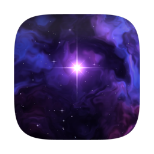
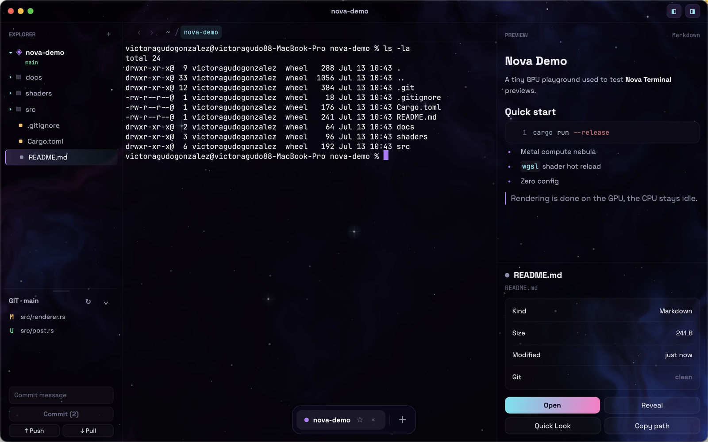
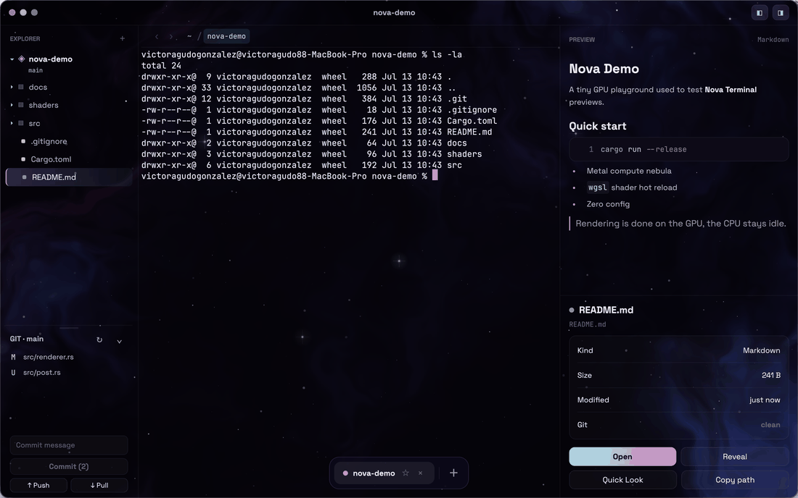
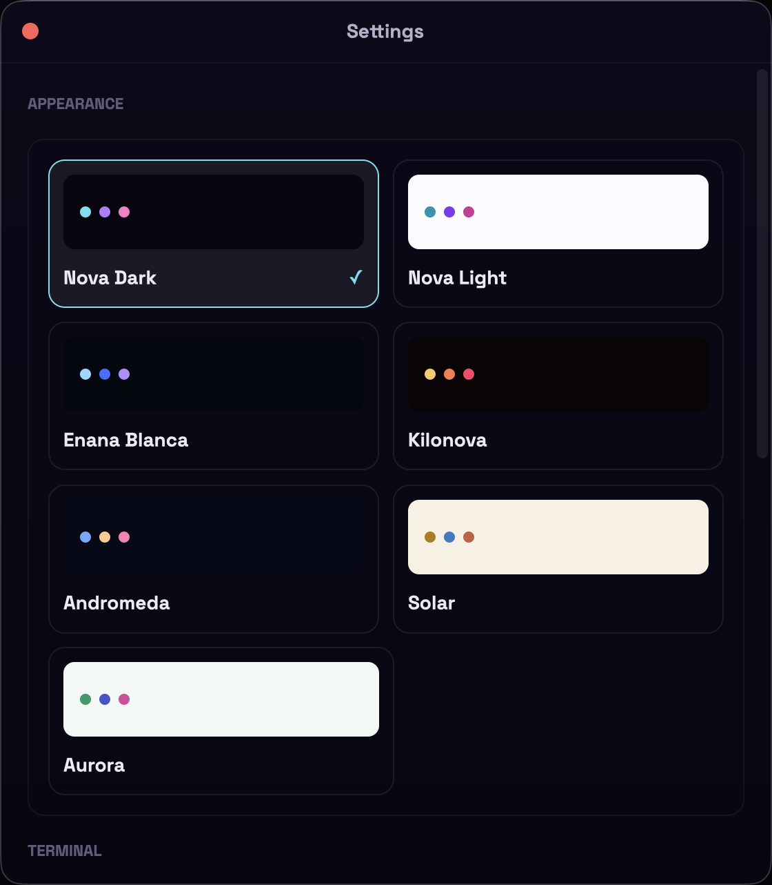

# Nova Terminal

**A native macOS terminal that feels alive.**

GPU rendered. Written in pure Rust. Beautiful by default.

 

 

## Why Nova

Most terminals look the same. Nova puts your shell inside a living cosmic scene, and adds the tools you use every day: a file explorer, git, and a rich preview panel. Everything runs in one small native app.

## Features

- **Cosmic background**: a real FBM nebula computed on the GPU with Metal, plus stars and shooting stars. It pauses when the window is not active.
- **Seven themes**: four dark, three light. Each one retunes the whole app, including the 16 ANSI terminal colors. Switch with `Cmd+Shift+L` or from Settings.
- **File explorer**: it follows your shell, so `cd` in the terminal re-roots the tree. Git status per file, back and forward history, create, rename, copy, move, delete, and run scripts from the context menu.
- **Preview panel**: markdown, syntax highlighted code, diffs, images, SVG, PDF, hex and archives. PDF renders in process, without helper apps. `Cmd+F` searches inside every text preview with highlights.
- **Git panel**: changed files at a glance, commit, push and pull. Click a file to see a GitHub style diff. Resizable and persistent.
- **Pinned tabs**: star a tab and it stays in the dock as a favorite, even after you close the app. One click reopens it in its folder.
- **Auto updates**: Nova checks GitHub releases through Sparkle and updates itself. Updates are signed with EdDSA on top of the Developer ID signature.
- **Real terminal**: login shell, 10k lines of scrollback, live reflow when the panel or the font size changes, mouse reporting for TUIs with `Shift` to bypass, text selection by character, word or line, drag files in to paste their paths, and bracketed paste.
- **One click actions**: Open, Reveal in Finder, copy path, and the real macOS Quick Look panel, straight from the preview.
- **Session restore**: tabs, sizes, theme and layout come back exactly as you left them.

## Themes

| Theme | Family | Personality |
| --- | --- | --- |
| Nova Dark | Dark | Violet cosmos, the original look |
| Nova Light | Light | Clean white with violet accents |
| Enana Blanca | Dark | Cold blue silver, like a white dwarf star |
| Kilonova | Dark | Molten gold and crimson, the only warm dark |
| Andromeda | Dark | Deep galaxy blue with a golden core |
| Solar | Light | Warm paper and sun gold, no effects, it is daytime |
| Aurora | Light | Glacial boreal light with emerald and orchid |

## Keyboard

| Shortcut | Action |
| --- | --- |
| `Cmd+T` / `Cmd+W` | New tab, close tab (pinned tabs ask first) |
| `Ctrl+Tab` / `Ctrl+Shift+Tab` | Next and previous tab |
| `Cmd+Shift+L` | Cycle themes |
| `Cmd+F` | Search in the terminal or in the preview |
| `Cmd+click` | Open a link printed in the terminal, hover shows a hint |
| `Shift+Enter` | Newline in TUIs like Claude Code and opencode |
| `Cmd+←` / `Cmd+→` | Line start and end |
| `Option+←` / `Option+→` | Jump by word |
| `Cmd+Backspace` / `Option+Backspace` | Delete line, delete word |
| `Cmd+,` | Settings |
| Hold `Cmd+Q` | Quit, with an on screen progress bar |

## Make it yours

One font size controls the whole app, from the terminal grid to the file tree. Pick between six monospace families, choose any installed shell for new tabs, and turn hold to quit on or off.

## Performance

Nova is designed to stay out of your CPU:

- The animated background lives in its own small view. The heavy UI tree only redraws when something real changes.
- The terminal core is never locked during paint. Each frame copies the visible grid once and releases it.
- The nebula is a Metal compute kernel at half resolution, with a CPU fallback.
- Animations pause completely when the window loses focus.
- One small download, about 9 MB plus the updater framework.

## Tech stack

| Layer | Technology |
| --- | --- |
| Language | 100 percent Rust |
| UI framework | [GPUI](https://github.com/zed-industries/zed), the Metal based framework behind Zed |
| Terminal core | [alacritty_terminal](https://crates.io/crates/alacritty_terminal) |
| Updates | [Sparkle 2](https://sparkle-project.org) fed by GitHub releases |
| Highlighting | syntect |
| Markdown | pulldown-cmark |
| Fonts | JetBrains Mono and Space Grotesk, embedded in the binary |

## Engine

Two crates with a strict split:

- `nova-engine` owns the PTY, the terminal state and the color palette. It has zero UI dependencies and only hands owned snapshots to the UI.
- `nova` is the GPUI app: window, themes, explorer, previews, git and settings.

Each tab is fully independent: one PTY, one terminal, one background IO thread.

## Releases

Every release is built by CI from a clean checkout:

- Versions follow semver and bump automatically from the commit history.
- Release notes are generated from the commits since the previous tag.
- The app is signed with a Developer ID and ships as a styled drag to install `.dmg`.
- The appcast for auto updates is published together with each release.

## Install

1. Download the latest `.dmg` from [Releases](https://github.com/victoragudo/nova-terminal/releases/latest).
2. Open it and drag **Nova** into **Applications**.

Every build is signed and notarized by Apple, so macOS opens it with no warnings.
Requires an Apple Silicon Mac. After the first install, Nova updates itself.

## Roadmap

**Now**
- [x] Notarized builds, the first launch needs no right click
- [x] Live terminal reflow when the panel or font size changes

**Next**
- [ ] Split panes
- [ ] Command palette
- [ ] Drag to reorder tabs
- [ ] Configurable shortcuts

**Later**
- [ ] User defined themes
- [ ] Universal binary with Intel support
- [ ] Per project profiles

## Feedback

This repository hosts the official releases. Bug reports and ideas are welcome in [Issues](https://github.com/victoragudo/nova-terminal/issues), or straight from the app: **Nova menu, Send Feedback**.
