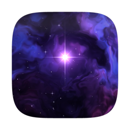
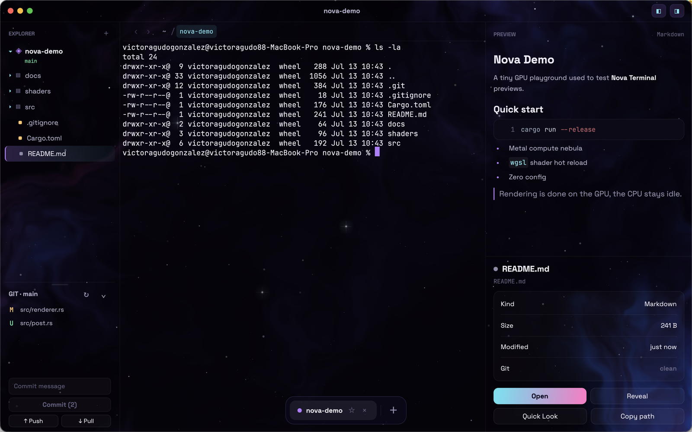
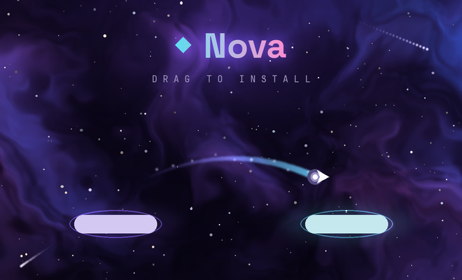
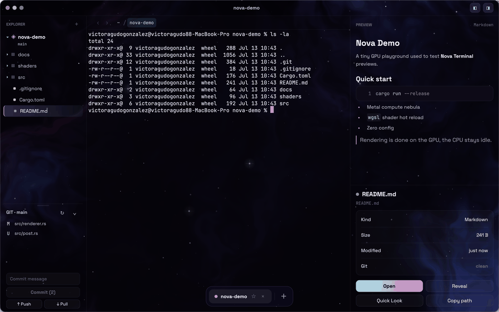
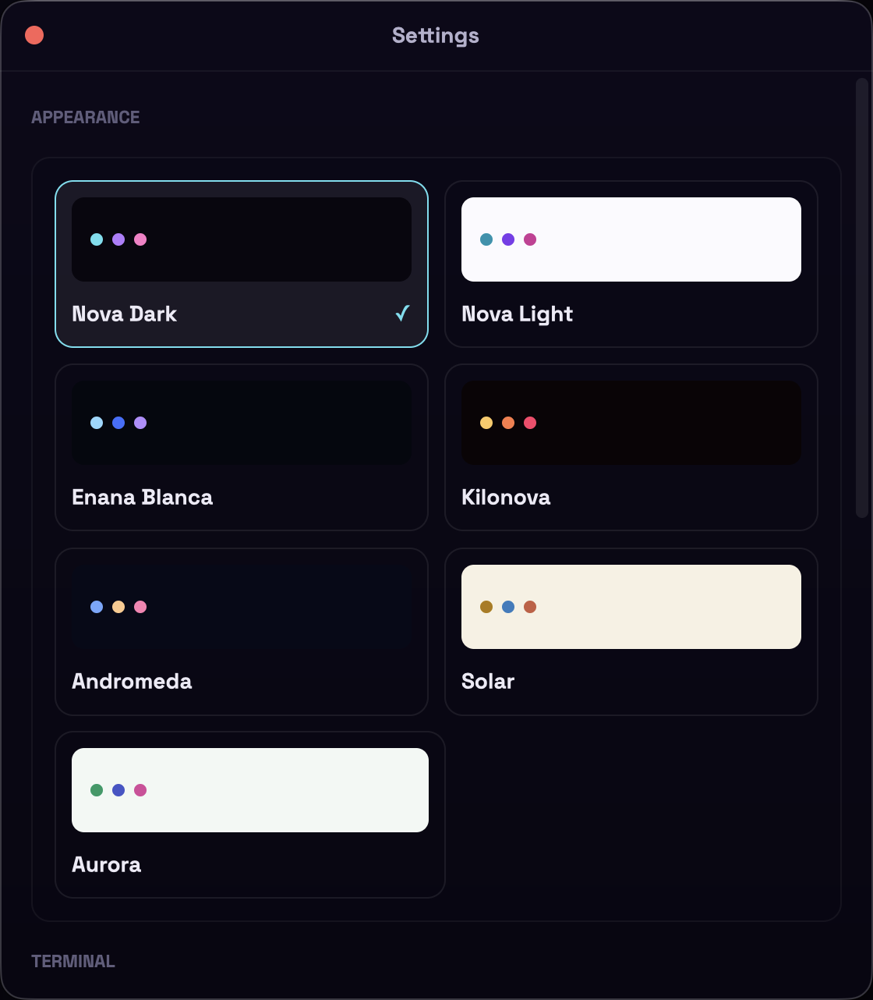

# Nova Terminal

**Official releases for Nova Terminal**

GPU rendered. Native macOS. Pure Rust.

 

## What Is Nova?

Nova is a native macOS terminal with a cosmic visual system, a real terminal core, a file explorer, previews, Git tools, themes, and an iPhone remote. It is built in Rust on top of [GPUI](https://github.com/zed-industries/zed) and an [`alacritty_terminal`](https://crates.io/crates/alacritty_terminal) emulation core.

## What Is In This Repository?

This public repository hosts:

- signed `.dmg` releases
- the Sparkle update feed in `appcast.xml`
- screenshots and release notes
- the public issue tracker

Development happens in a separate private source repository. Official releases and auto-updates are published here.

## Features

- Native terminal tabs running the user's real login shell.
- GPU animated nebula background with stars and shooting stars.
- File explorer that follows the current shell directory.
- Rich preview panel for code, images, SVG, PDF, archives, diffs, and hex.
- Git panel for changed files, commit, pull, and push.
- Multiple built-in themes, including dark and light variants.
- iPhone remote for switching windows and tabs, sending prompts, and quick control keys.
- Session restore, settings persistence, and Sparkle auto-updates.

## Install

1. Download the latest `.dmg` from [Releases](https://github.com/victoragudo/nova-terminal/releases/latest).
2. Open it and drag **Nova** into **Applications**.
3. Launch Nova.

Requirements:

- macOS 14 or later
- Apple Silicon Mac

Every public build is signed and notarized by Apple.

## Auto Updates

Nova checks this repository for updates through Sparkle.

- Releases: `https://github.com/victoragudo/nova-terminal/releases`
- Appcast: `https://raw.githubusercontent.com/victoragudo/nova-terminal/main/appcast.xml`

After the first install, Nova can update itself from the app.

## Themes

Nova ships with multiple built-in themes that restyle the whole app, including terminal colors, chrome, accents, and panels.

## Settings

You can change the terminal font size, choose the shell used for new tabs, pick the active theme, and control app behaviors from the native settings window.

## Feedback

This repository is the public home for Nova releases.

- Bug reports and feature requests: [Issues](https://github.com/victoragudo/nova-terminal/issues)
- Latest build: [Releases](https://github.com/victoragudo/nova-terminal/releases/latest)
