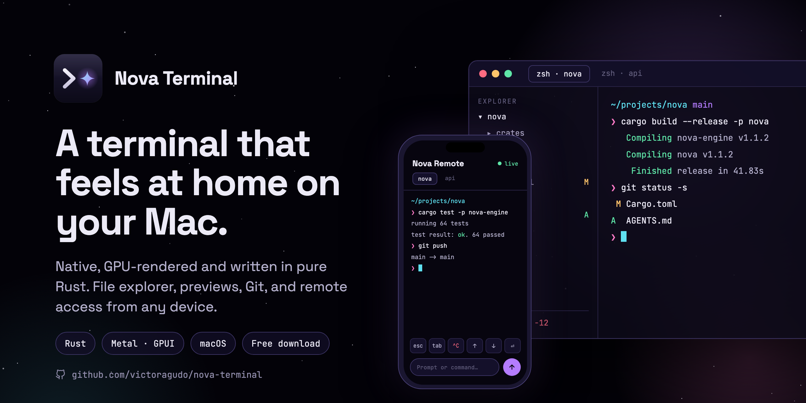
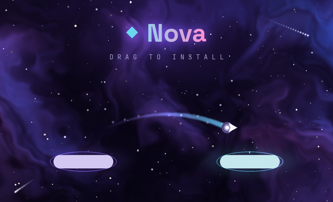
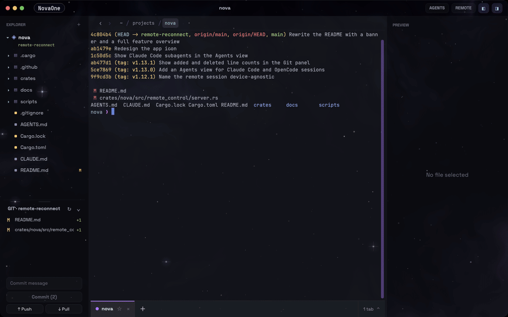

  

# Nova Terminal

Nova is a terminal for macOS. I wrote it in Rust because I wanted something fast that also looks nice, and that has the things I use every day (files, previews, Git, my AI agents) in the same window.

There is no Electron and no webview. The GPU draws everything through Metal.

## Install

1. Download the latest `.dmg` from [Releases](https://github.com/victoragudo/nova-terminal/releases/latest).
2. Open it and drag **Nova** into **Applications**.
3. Open Nova. That's it.

You need an Apple Silicon Mac with macOS 13 or newer. Every build is signed and notarized by Apple, and Nova updates itself with Sparkle.

  

## What it does

**Terminal**
- Every tab has its own shell. It starts as a login shell, so it loads the same profile as Terminal.app.
- Full colors (16, 256 and truecolor), scrollback, selection, search.
- Tabs come back when you open the app again. You can rename them, pin favorites and reorder them by dragging.
- Links work in TUIs too, even when they wrap across lines, and you can choose which Chrome profile opens them.

**Workspace**
- A file tree on the side that follows your `cd`.
- Create, rename, copy, move and delete files without leaving the app.
- Previews for code (with syntax colors), images, SVG, PDF, zip files and hex. One click opens the native Quick Look.
- Back and forward history, like a browser.

**Git**
- Branch and status badges in the file tree.
- A small Git panel with added and deleted line counts, commit, pull and push.

**Agents**
- An Agents view that lists every Claude Code and OpenCode session on your Mac, subagents included.
- It groups them into "needs you", "working" and "idle". From there you can jump to the agent's tab, approve or interrupt it.

**iPhone remote**
- Open your real Nova windows and tabs from your phone and type into them. There are keys for Enter, Ctrl-C, Esc, Tab and the arrows.
- You can switch or close tabs, open new ones, upload files and scroll the whole history.
- By default it goes through a temporary Cloudflare tunnel and keeps the Mac awake. If you prefer, it also works on your LAN or VPN (`NOVA_REMOTE_CLOUDFLARE=0`).
- If the tunnel dies or the app crashes, a watchdog brings it back and can send you the new URL on Telegram.

**Looks**
- An animated nebula background with stars and the odd shooting star.
- Nine themes: Nova Dark, Nova Light, Enana Blanca, Kilonova, Andromeda, Solar, Aurora, Púlsar and NovaOne.
- JetBrains Mono and Space Grotesk come inside the app.

  

## Performance

I care a lot about this part, so here is what Nova actually does:

- **Paint never waits for the terminal.** Each frame takes a quick copy of the visible screen and releases the lock straight away. The shell keeps writing while the UI draws.
- **The background doesn't touch the UI.** The nebula lives in its own small view. The rest of the app is cached and only redraws when something really changes, like new output, typing or a resize.
- **The nebula runs on the GPU.** It's a Metal compute shader at half resolution, capped at about 30 fps. It only goes to 60 fps while a shooting star is on screen.
- **It sleeps when you're not looking.** When the window is not active, all the animation stops.
- **Slow work stays off the main thread.** Git status, previews and the current folder lookup run in the background.
- **Small binary.** The release build is about 12 MB (thin LTO, stripped), with fonts and images included.

## Stack

| Part | What |
|------|------|
| Language | Rust (stable) |
| UI | [GPUI](https://github.com/zed-industries/zed), Zed's UI framework on Metal |
| Terminal core | [`alacritty_terminal`](https://crates.io/crates/alacritty_terminal) |
| Background | Metal compute kernel (MSL built at runtime), with a CPU fallback |
| Previews | syntect, resvg, CoreGraphics for PDF, zip |
| Updates | [Sparkle](https://sparkle-project.org), vendored in `vendor/sparkle` |
| Remote | Small built-in web server, Cloudflare Tunnel, optional tmux mode |

The source code lives in a private repo. This one has the releases, the update feed and the issue tracker. The code is split into two crates:

- **`crates/nova-engine`**: the terminal core. One PTY, one terminal model and one I/O thread per tab. It has no UI code and only gives the UI owned data (`RenderSnapshot`, `EngineEvent`).
- **`crates/nova`**: the app itself. Window, tabs, file tree, previews, Git, themes, settings, Agents view and the remote.

## Feedback

Found a bug or have an idea? Open an [issue](https://github.com/victoragudo/nova-terminal/issues). I read all of them.

## Known limits

- The terminal grid is fixed at 94 × 32 for now. Reflow to the real panel size is next.
- GPUI has no styled scrollbars, so Nova draws its own.
- The default remote needs Docker running.

## License

MIT
